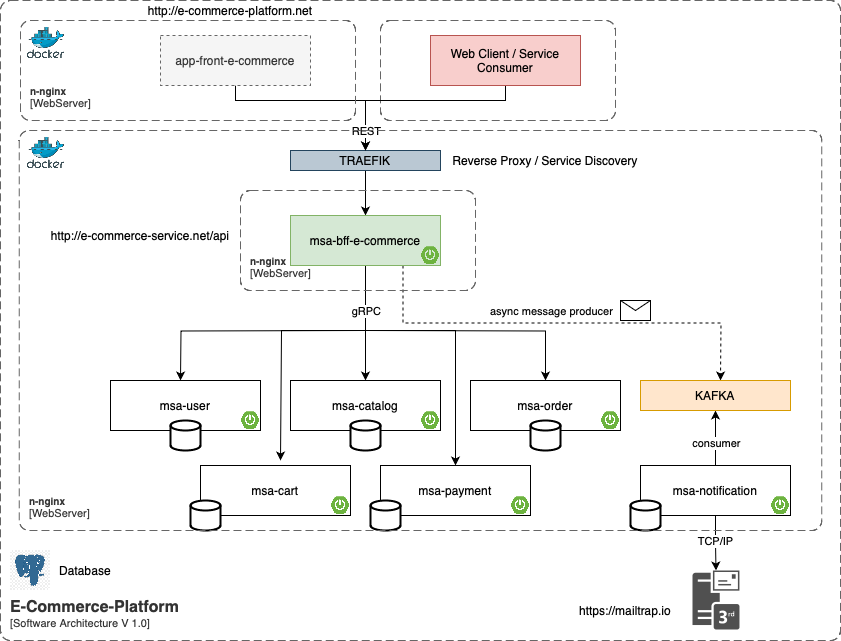

# **<u>e-commerce-platform</u>**
Es una aplicacion para procesos de e-commerce, posee implementacion en backend y en frontend.

## Especificacion

### Arquitectura
Solucion formado por una arquitectura de microservicios como se muestra a continuacion:

## Instalacion
### Construccion de la imagen

Para cada uno de los componentes involucrados, construir su respectiva imagen de la ruta base `e-commerce-platform`
- e-commerce-msa-user:

>     docker build -f ./e-commerce-msa-user/Dockerfile --build-arg TARGET_PATH=./e-commerce-msa-user/target --build-arg JAR=e-commerce-msa-user-1.0.0-SNAPSHOT.jar -t e-commerce-msa-user:1.0 .

